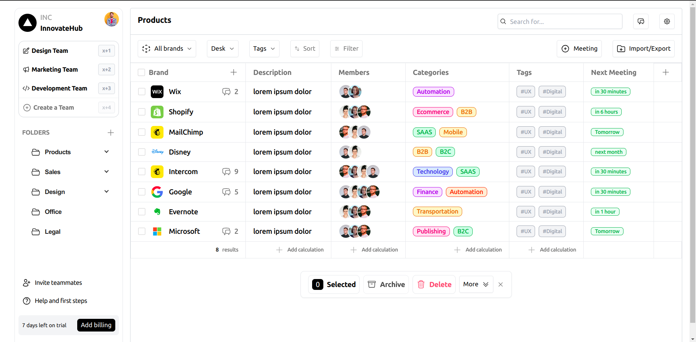

## Frontend Assignment - Krite

### Setup Instruction:

1. unzip the zipped file.
2. cd into folder `Krite-frontend-assignment`
3. Install the dependencies
 ```bash
  npm install
  ```
4. Run the server locally
```bash
  npm run dev
  ```
5. open browser and access
`http://localhost:5173`

### Output: 

